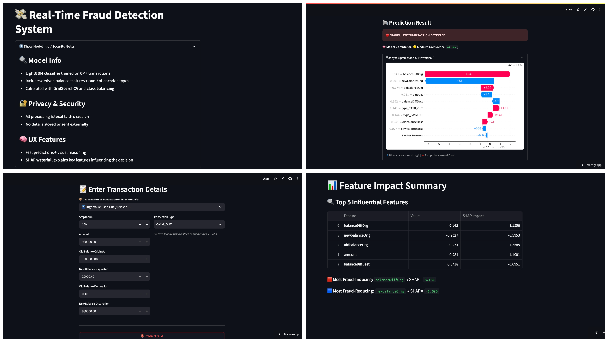

# Real-Time Fraud Detection System


## Table of Contents
- [1. Project Overview](#1-project-overview)
- [2. Business Problem & Impact](#2-business-problem--impact)
- [3. Dataset Information](#3-dataset-information)
- [4. Methodology](#4-methodology)
- [5. Model Performance](#5-model-performance)
- [6. Model Interpretability (XAI)](#6-model-interpretability-xai)
- [7. MLOps & Scalability Considerations](#7-mlops--scalability-considerations)
- [8. How to Run Locally](#8-how-to-run-locally)
- [9. Model Confidence Logic](#9-model-confidence-logic)
- [10. SHAP Sample Output](#10-shap-sample-output)
- [11. Screenshot](#11-screenshot)
- [12. Future Work](#12-future-work)
- [13. Folder Structure](#13-folder-structure)
- [14. License](#14-license)
- [15. Acknowledgements](#15-acknowledgements)
- [16. Live Demo](#16-live-demo)
- [17. Questions?](#17-questions)


## 1. Project Overview

This project focuses on detecting fraudulent financial transactions using a LightGBM classifier trained on a highly imbalanced real-world dataset. The Streamlit web app allows:

- ✅ Real-time fraud prediction
- 🔍 SHAP-based model explanation for every prediction
- 🧠 Model confidence display (High / Medium / Low)
- ⚙️ Presets for fast testing
- 🎨 Clean and intuitive 2-tab UI: Predict | Feature Impact

The model is trained on a Kaggle dataset with over **6 million transactions** and balances precision/recall for fraud detection.

---

## 2. Business Problem & Impact

Banking and payment apps face massive losses due to fraudulent activities. Detecting fraud in real-time is critical, especially given:

- ⚠️ Only ~0.1% of all transactions are fraudulent.
- 🧾 Legitimate transactions often resemble fraud.
- 🧠 Models must balance false positives vs. false negatives carefully.

---

## 3. Dataset Information

- **Source**: [Kaggle: Fraud Detection Dataset](https://www.kaggle.com/datasets/amanalisiddiqui/fraud-detection-dataset)
- **Records**: ~6 million transactions
- **Features Used**:
  - `step`, `amount`, `oldbalanceOrg`, `newbalanceOrig`
  - `oldbalanceDest`, `newbalanceDest`, `transaction_type`
- **Target**: `isFraud`

---

## 4. Model Details

- Algorithm: **LightGBM Classifier**
- Feature Scaling: `StandardScaler`
- Class Imbalance Handling: `class_weight='balanced'`
- Hyperparameter Tuning: `GridSearchCV`
- Feature Explanation: `SHAP`

---

## 5. Model Performance

| Metric       | Value    |
|--------------|----------|
| Accuracy     | 91.67%   |
| Precision    | 85.71%   |
| Recall       | 100.00%  |
| F1-Score     | 92.31%   |
| ROC AUC      | 98.78%   |

These values reflect the model’s ability to detect fraud without missing true positives (Recall = 1.0).

---

## 6. Model Interpretability (XAI)

Every prediction includes a **SHAP Waterfall Plot** explaining:

- How each feature contributed to the prediction
- Whether the feature pushed the result toward fraud or legitimate
- The relative importance of features like `amount`, `oldbalanceOrg`, etc.

This makes the system **transparent and trustworthy**.

---

## 7. MLOps & Scalability Considerations

- Streamlit app with **two tabs**:
  - **Predict**: Enter data manually or use presets
  - **Feature Impact**: View SHAP explanations
- **Model confidence** (Low, Medium, High) based on predicted probability
- Class probability bar chart
- Dropdowns and sliders for interactive inputs
- 🎛️ Presets included:
  - 🏧 High-Value Cash Out (Suspicious)
  - 📥 Typical Payment (Legitimate)

---

## 8. How to Run Locally

1. Clone the repository  
   `git clone https://github.com/grimm-ak/fraud_detection_project.git`

2. Install dependencies  
   `pip install -r requirements.txt`

3. Run the Streamlit app  
   `streamlit run app.py`

4. Visit `http://localhost:8501` in your browser.

> 💡 Use the built-in presets for fast testing!

---

## 9. Model Confidence Logic

| Confidence Score | Interpretation        |
|------------------|-----------------------|
| < 60%            | 🔴 Low Confidence     |
| 60–90%           | 🟡 Medium Confidence  |
| > 90%            | 🟢 High Confidence    |

The app uses this logic to provide **warnings** or **assurance** about the prediction quality.

---


## 10. SHAP Sample Output

Here’s what the SHAP Waterfall Plot explains for each transaction:

This plot breaks down the model’s fraud prediction for a specific transaction. Each bar represents how much a feature pushed the prediction towards **fraud** (red) or **non-fraud** (blue). The base value (model’s average prediction) is adjusted feature-by-feature to reach the final fraud probability.


## 11. Screenshot




## 12. Future Work

- Add Docker support
- Add database logging of suspicious predictions
- Incorporate user authentication for app usage
- Deploy on GCP/AWS for enterprise integration


## 13. Folder Structure
The project repository is organized to provide a clear and maintainable structure for development, deployment, and documentation.

```text
fraud_detection_project/
├── .github/                       # GitHub Actions workflows for automation (e.g., app uptime)
│   └── workflows/
│       └── ping.yml               # GitHub Actions workflow to keep the Streamlit app awake
├── .streamlit/                    # Streamlit-specific configuration files
│   └── config.toml                # Streamlit app settings (e.g., file watcher settings)
├── app.py                         # The main Streamlit web application script for prediction
├── best_lgbm_clf_model.joblib     # Pre-trained LightGBM classification model
├── scaler.joblib                  # Fitted StandardScaler for preprocessing new inputs
├── requirements.txt               # Python dependencies required for the Streamlit app
├── NoteBook/                      # Folder for Jupyter Notebooks and detailed analysis
│   └── Fraud_Detection_Notebook.ipynb # Your detailed Jupyter/Colab notebook with all code 
├── README.md                      # Project documentation and overview (this file)
└── images/                        # Folder to store images/screenshots used in README.md
    ├── screenshot.png             # Screenshot of the deployed Streamlit app
    └── shap-waterfall.png         # Screenshot of the SHAP Waterfall plot
```
## 14. License

This project is open-source and available under the **MIT License**.

---

## 15. Acknowledgements

- [Kaggle Fraud Dataset](https://www.kaggle.com/datasets/amanalisiddiqui/fraud-detection-dataset)
- [SHAP (SHapley Additive exPlanations)](https://github.com/slundberg/shap)
- [Streamlit.io](https://streamlit.io)

## 16. Live Demo

🌐 [Live App on Streamlit Cloud](https://frauddetectionproject-o2sgpzkvmz8ac6edt54h8a.streamlit.app/)

---

## 17. Questions?

Feel free to open an issue or drop a comment in the repo. Happy to help!
